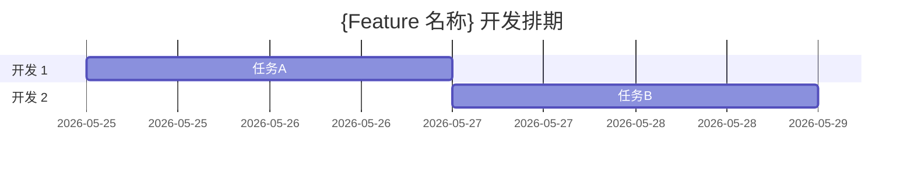

# 通用非 Android Feature 需求矩阵编写

## 目标

根据用户提供的原始需求资料和非 Android 技术方案文档，为后端服务、Web 前端、iOS、桌面端、云平台、数据平台、AI/ML 服务、基础设施、中台系统、SDK/库等软件工程新特性、版本需求或功能改造生成一份可评审、可排期、可执行的需求矩阵。矩阵需要覆盖功能拆解、依赖关系、工作量、人力安排、开始/完成时间、负责人、适用端/平台、风险和状态，并在多人开发时给出任务甘特图。

模板原文放在 `references/template.md`。编写时保持模板的项目基本信息、需求矩阵 12 个必填列和新功能必写行，不要删除必填内容。

## 触发场景

仅在任务同时满足以下条件时使用本 skill：

1. 需求对象属于非 Android 软件工程：后端服务、Web 前端、iOS、桌面端、云平台、数据平台、AI/ML 服务、基础设施、中台系统、SDK/库、CLI 工具、企业内部系统等。
2. 用户目标是把 feature/版本需求拆解为开发任务、估算工作量、安排排期、输出需求矩阵或甘特图。

典型触发场景：

- 用户要求写非 Android feature 的需求矩阵、需求排期矩阵、开发任务矩阵、工作量矩阵。
- 用户提供 PRD、需求说明、截图、Jira/Confluence 内容或口头需求，希望拆任务和排期。
- 用户同时提供技术方案，希望根据实现细节拆解开发任务。
- 用户要求把任务拆到人天粒度、按多人并行安排、输出甘特图或开发计划。
- 用户要求复用“通用需求矩阵模版/模板”来填写。

不要在以下情况使用本 skill：

- 需求对象属于 Android 开发，应使用 Android 需求矩阵类 skill。
- 用户只要求写技术方案、方案评审材料或轻量技术设计，应使用通用技术方案类 skill。
- 用户要求概要设计/HLD 或公司概要设计模板，应使用通用 HLD 类 skill。
- 用户只是做纯产品/运营排期，且不涉及软件工程开发任务。
- 上下文无法判断是否非 Android 工程时，先向用户确认，不要仅凭“需求矩阵/排期/模板”等关键词触发。

## 必要输入

开始编写前，先确认以下输入是否齐全：

1. 原始需求资料：PRD、需求说明、需求截图、交互稿、接口说明、Jira/Confluence 链接或用户粘贴的需求内容。可以是一种或多种形式。
2. 技术方案文档：决定实现细节的方案文档、概要设计、接口/模块设计，或用户提供的等价说明。
3. 开始时间：必填，格式优先使用 `YYYY-MM-DD`。
4. 结束时间：选填。若提供，需要在给定时间区间内按工作日排期，并在结束时间前预留 2 个工作日缓冲；若未提供，则根据任务量、依赖关系和人数按工作日顺排。
5. 参与该需求开发的人员数量：必填。若用户给出具体人员姓名或角色，也要使用；若只有人数，则负责人可暂用 `开发 1 / 开发 2 / ...`。

如果缺少原始需求资料、技术方案、开始时间或开发人数，不要直接编写完整矩阵；先让用户补充缺失信息。结束时间缺失时可以继续，但需要明确说明会按任务量自动编排。

## 工作流程

### 1. 认真阅读资料

先阅读用户提供的所有资料和文档。不要只根据标题、文件名或模板示例生成矩阵。

- 如果用户给的是本地文件路径，使用文件工具读取内容。
- 如果用户给的是工程路径或代码上下文，先搜索关键模块、入口、调用链和已有实现。
- 如果资料很长，先提炼需求范围、业务流程、技术实现路径、外部依赖和待确认点。
- 对无法从资料中确定的信息，用“待确认”标注，不要编造。

### 2. 提取通用软件工程视角信息

从资料中整理以下内容，用于后续任务拆解：

- 功能边界：本期做什么、不做什么、灰度/开关范围。
- 用户或业务流程：入口、页面/接口/任务触发、状态变化、异常分支、空态/错误态。
- 前端/客户端实现：页面、组件、状态管理、路由、交互、可访问性、浏览器/系统版本适配。
- 后端/服务实现：API、鉴权、幂等、限流、缓存、消息队列、异步任务、定时任务、批处理。
- 数据和接口：网络 API、RPC、事件、数据库、缓存、对象存储、数据结构、协议字段。
- 基础设施：配置、部署、网关、服务发现、日志、监控、告警、CI/CD、灰度、回滚。
- 质量要求：埋点、日志、容灾、性能、稳定性、安全隐私、兼容性、可维护性。
- 验证要求：单元测试、集成测试、端到端测试、接口联调、自测 Checklist、QA 验证点。

### 3. 拆解任务

先按依赖关系拆分，再估算工作量：

- 每个需求矩阵行代表一个可交付子任务，粒度控制在 3 人天以内。
- 如果某项超过 3 人天，继续拆分到 3 天以内，例如拆成“接口契约定义 / 数据模型设计 / 服务实现 / 前端接入 / 异常处理 / 测试验证”。
- 被依赖任务排在前面；依赖关系写入“前置依赖条件”。
- 不要把评审、沟通、联调、冒烟、自测全部混成一个大任务，必要时拆成独立行。
- 工作量以开发人天估算，可以包含开发、自测、联调和必要文档，但不要把 QA 专项测试算入开发工作量，除非用户明确要求。

优先考虑这些通用软件工程任务类型：

- 工程/模块接入、依赖配置、feature flag、路由入口。
- 数据模型、接口协议、API/RPC、事件契约、缓存和持久化。
- 前端页面、状态管理、交互、错误/空态/加载态。
- 后端服务、异步任务、消息队列、定时任务、批处理、幂等和事务。
- 数据库表结构、索引、迁移脚本、数据修复、数据一致性。
- 浏览器/系统/版本/多端适配、多语言、可访问性、暗黑模式、埋点。
- 日志、监控、告警、性能、稳定性、安全隐私、降级/回滚。
- 单元测试、集成测试、E2E 测试、自测 Checklist、联调和验收支持。

### 4. 排期规则

根据输入时间和人数安排开始/完成时间：

- 开始时间优先使用用户给定时间；如果该日期落在周末，按下方规则顺延到下一个工作日。
- 日期默认按工作日编排，只安排周一到周五；周六、周日不计入开发工作量，也不要作为任务开始时间或完成时间。
- 如果用户给定的开始时间落在周末，将实际排期开始时间顺延到下一个周一，并在排期说明中标注。
- 若有结束时间：在结束时间前预留 2 个工作日缓冲，用于查漏补缺、问题修复、补测和风险兜底；开发任务应尽量排在缓冲之前完成。如果结束时间落在周末，按结束时间之前最近的工作日作为排期截止点。
- 若无结束时间：按任务总量、前后依赖、人员数量、可并行性和工作日自动推导完成时间；仍建议在尾部附加 2 个工作日缓冲安排。
- 多人开发时，先判断任务是否真的能并行。不能并行的任务不要强行并行排期。
- 可并行任务应尽量按模块边界分配，例如前端与后端、接口联调与测试补充、数据层与非阻塞优化。
- 若任务量明显无法在给定结束时间前完成，直接说明排期风险，并给出压缩建议：减范围、加人、降低非核心任务优先级、延后低风险适配项等。
- 只有当用户明确要求按自然日、节假日或特定冲刺日历排期时，才按用户给定规则调整。

### 5. 多人开发甘特图

当开发人数大于 1 时，需求矩阵后必须单独给出任务甘特图。

优先使用 Mermaid：



甘特图要求：

- 按负责人分 section。
- 体现关键依赖和可并行任务。
- 包含 2 个工作日缓冲任务，例如“缓冲：查漏补缺/问题修复”。
- 甘特图与需求矩阵中的开始/完成时间保持一致。

## 输出格式

默认输出完整 Markdown 文档。若用户指定保存路径，则写入该路径，并在完成后说明绝对路径。

建议结构：

```markdown
# {Feature 名称} 需求矩阵

## 项目基本信息

| 字段 | 内容 |
| --- | --- |
| 项目名称 | {项目名称或待确认} |
| 编写者 | {编写者或待确认} |
| 所属部门 | {部门或待确认} |
| QA | {QA 或待确认} |
| 文档状态 | 草稿 |
| 完成日期 | {矩阵完成日期或待确认} |
| 总工作量 | {xx 人/天，含/不含缓冲需说明} |

## 需求矩阵

| 一级功能 | 二级功能 | 三级功能 | 需求功能描述 | 前置依赖条件 | 开发工作量（人天） | 开始时间 | 完成时间 | 负责人 | 适用端/平台 | 风险 | 状态 |
| --- | --- | --- | --- | --- | --- | --- | --- | --- | --- | --- | --- |
| ... | ... | ... | ... | ... | ... | ... | ... | ... | ... | ... | 未开始 |

## 多人任务甘特图

{仅多人开发时必填}

## 排期说明与风险

- 排期依据：...
- 缓冲安排：...
- 关键依赖：...
- 主要风险：...
- 待确认事项：...
```

### 需求矩阵必填列

需求矩阵表格必须包含以下 12 列，不可删除：

1. 一级功能
2. 二级功能
3. 三级功能
4. 需求功能描述
5. 前置依赖条件
6. 开发工作量（人天）
7. 开始时间
8. 完成时间
9. 负责人
10. 适用端/平台
11. 风险
12. 状态

### 新功能必写行

以下适配/质量项必须在新功能需求矩阵中出现。即使当前判断“不涉及”，也要保留一行并写明“不涉及原因/待确认/风险”：

| 必填模块 | 适用端/平台 | 编写要求 |
| --- | --- | --- |
| 多语言/国际化 | 通用 | 评估新增文案、资源、日期数字格式、时区、货币、RTL 或地区差异。 |
| 可访问性 | 通用 | 评估键盘导航、屏幕阅读器、语义标签、焦点顺序、颜色对比和操作区域。 |
| 主题/暗黑模式 | 通用 | 评估颜色 token、图片资源、背景/前景对比度和主题切换。 |
| 埋点/日志 | 通用 | 规划曝光、点击、成功/失败、异常、耗时等事件及字段，区分业务埋点和工程日志。 |
| 监控/告警 | 通用 | 规划关键指标、错误率、延迟、队列积压、资源使用和告警阈值。 |
| 安全/隐私 | 通用 | 评估鉴权、授权、数据脱敏、敏感日志、合规要求和权限边界。 |

## 质量检查清单

输出前检查：

- 是否已经阅读并理解原始需求资料和技术方案。
- 缺少开始时间、开发人数、原始需求资料或技术方案时，是否先向用户补充询问。
- 每个任务是否都在 3 人天以内；超过 3 天的是否已继续拆分。
- 任务顺序是否符合前后依赖，被依赖子项是否排在前面。
- 多人开发时，是否只并行真正可并行的任务，并给出甘特图。
- 排期是否默认只使用工作日，且任务开始/完成时间没有落在周六或周日。
- 如果有结束时间，是否在结束时间前预留 2 个工作日缓冲。
- 新功能必写行：多语言/国际化、可访问性、主题/暗黑模式、埋点/日志、监控/告警、安全/隐私是否都保留。
- 是否覆盖通用软件工程关键补充项：接口联调、数据迁移、部署配置、日志/性能/稳定性、安全隐私、测试验证、降级/回滚。
- 是否标注了排期风险、待确认事项和压缩建议。
